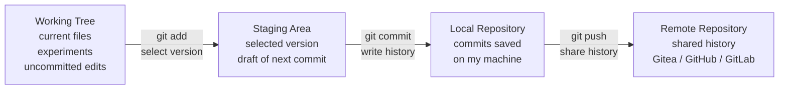

# Git Mental Model Through Gitea

This repository is a public learning artifact about the first time Git became understandable through a real Gitea project. It keeps the journey narrative, the technical mental model, and the generated diagrams together so another engineer can read, clone, regenerate, and reuse the material.

The core lesson is not a command cheat sheet. It is the shift from memorizing Git commands to understanding how Git organizes work into recoverable, reviewable, and shareable history.


## Project Overview
The story starts from an optical engineer moving into software engineering: learning Python independently, building tools and automation scripts, then meeting the practical workflows used by engineering teams.

Git was difficult because the commands were familiar but the state changes were not. Commands such as `git add`, `git commit`, `git push`, and `git pull` looked simple, but failures around remotes and merge conflicts made Git feel like a fragile black box.

The project changed when Git was used with a real Gitea repository. Creating the repository, pushing commits, seeing remote history, and resolving conflict situations made the hidden structure visible.

The main thesis:

> Git does not merely save files. Git preserves the team's ability to restart work.

That framing answers the engineering questions that a zip file or cloud folder cannot:

- What changed?
- Why did it change?
- Which changes are ready to commit?
- Which changes are only experiments?
- Which change introduced a bug?
- How can teammates receive the same history?
- Can the team restart work from a clean state?

## Features

- Narrative article that explains Git through a real learning journey from optical engineering into software engineering.
- Source-versus-generated-output model for deciding what belongs in version control.
- Four-place Git mental model: Working Tree, Staging Area, Local Repository, and Remote Repository.
- Concrete command workflow with `git status`, `git diff`, `git add`, `git diff --staged`, `git commit`, and `git push`.
- Merge-conflict explanation that treats conflicts as engineering decisions rather than Git failures.
- Generated visual assets for Medium, LinkedIn, README previews, and portfolio reuse.
- Content pack for resume STAR framing, LinkedIn publishing, commit/PR messaging, and future AI Agent Consultant positioning.

## Tech Stack

- Git for local version control and commit history.
- Gitea as the remote repository example in the learning story.
- Markdown for the README, Medium article draft, and content pack.
- Mermaid for the README architecture diagram.
- PowerShell with `System.Drawing` in `generate_git_mental_model_diagrams.ps1` for diagram generation.
- PNG assets stored under `medium-assets/`.

## Architecture

The mental model separates Git into four places. Each command becomes easier to reason about when it is understood as moving a selected state from one place to another.



### Source, Not Generated Output


Git should preserve Source, not every generated file produced by a machine or tool.

Source includes:

- source code
- configuration files
- documentation
- tests
- build scripts
- required assets
- anything needed to recreate the working system

Generated output usually includes:

- compiled binaries
- cache files
- logs
- temporary files
- build output
- Python `__pycache__`
- Node.js `node_modules`

The practical question becomes:

> If another engineer clones this repository, will they have enough Source to recreate the same working capability?

That is why `.gitignore` matters. It documents the boundary between project Source and local machine output.

### Command Meaning

`git add` does not simply mean "add to Git."

> `git add` takes the version I choose from the Working Tree and places it into the Staging Area.

`git commit` does not upload anything.

> `git commit` writes the staged version into local Git history.

`git push` is the sharing step.

> `git push` sends local Git history to the Remote Repository.

This separation explains why Git has several deliberate steps instead of one "save and upload" button. Git cares not only that files changed, but how an engineer organizes those changes into meaningful history.

## Folder Structure

```text
.
├── README.md
├── medium-git-mental-model-article.md
├── generate_git_mental_model_diagrams.ps1
├── medium-assets/
│   ├── git-mental-model-01.png
│   ├── git-mental-model-02.png
│   └── git-mental-model-03.png
└── docs/
    └── content-pack.md
```

## Installation

See Usage for regenerating diagrams and practicing the Git sequence.

## Usage

Clone the repository:

```bash
git clone <repository-url>
cd 260703_GitTea
```

Review the learning content:

```bash
less README.md
less medium-git-mental-model-article.md
less docs/content-pack.md
```

Regenerate the diagrams with PowerShell:

```bash
pwsh ./generate_git_mental_model_diagrams.ps1
```

The script writes the generated PNG files into `medium-assets/` and prints the file names and sizes.

Recommended Git workflow while editing this content:

```bash
# 1. Check the current working state
git status

# 2. Inspect what actually changed
git diff

# 3. Select the version I want in the next commit
git add <file>

# 4. Confirm what the next commit will contain
git diff --staged

# 5. Write the staged version into local history
git commit -m "Describe the change"

# 6. Share the local history with the remote repository
git push
```

The value is not only knowing the sequence. The value is knowing which Git state each command changes.

## Result

The current public assets are:

- `medium-assets/git-mental-model-01.png` - Working Tree, Staging Area, Local Repository, Remote Repository.
- `medium-assets/git-mental-model-02.png` - Source versus generated output and the `.gitignore` boundary.
- `medium-assets/git-mental-model-03.png` - Practical workflow from editing to shared history.

The article draft is:

- `medium-git-mental-model-article.md`

The packaging and publishing helper document is:

- `docs/content-pack.md`

Published Medium article:

- [From Optical Engineer to Software Engineer: The First Time I Understood Git Through Gitea](https://medium.com/p/d80175b1b839)

## Lessons Learned

- Git is an engineering system for history, collaboration, and recoverability, not only a way to save code.
- The Working Tree is the current working scene. It can contain finished changes, experiments, accidental edits, temporary files, or half-complete ideas.
- The Staging Area is the draft of the next commit. It contains the selected version, not necessarily everything currently edited.
- The Local Repository is history saved on the engineer's machine.
- The Remote Repository is shared history that teammates can clone, review, deploy from, and continue.
- A good commit message explains why a piece of history exists.
- A merge conflict is Git stopping because two histories changed the same place and Git cannot safely decide the correct meaning.
- Resolving a conflict means understanding both sides, choosing the correct final result, and committing that decision back into history.
- AI assistance is most valuable when it helps build reusable technical judgment instead of only providing commands to copy.

## Future Improvements

- Add a cross-platform diagram generator for Linux and macOS environments without PowerShell.
- Add SVG versions of the diagrams for sharper rendering in articles and slide decks.
- Expand the README with branch, merge, rebase, pull request, and fork mental models.
- Add a short teaching video or slide deck based on the same diagrams.
- Turn the content pack into a reusable portfolio template for AI Agent Consultant case studies.

## Project Isolation

This repository belongs only to the `260703_GitTea` project.

It should not contain files, notes, images, scripts, TODOs, or Git history from other projects.
