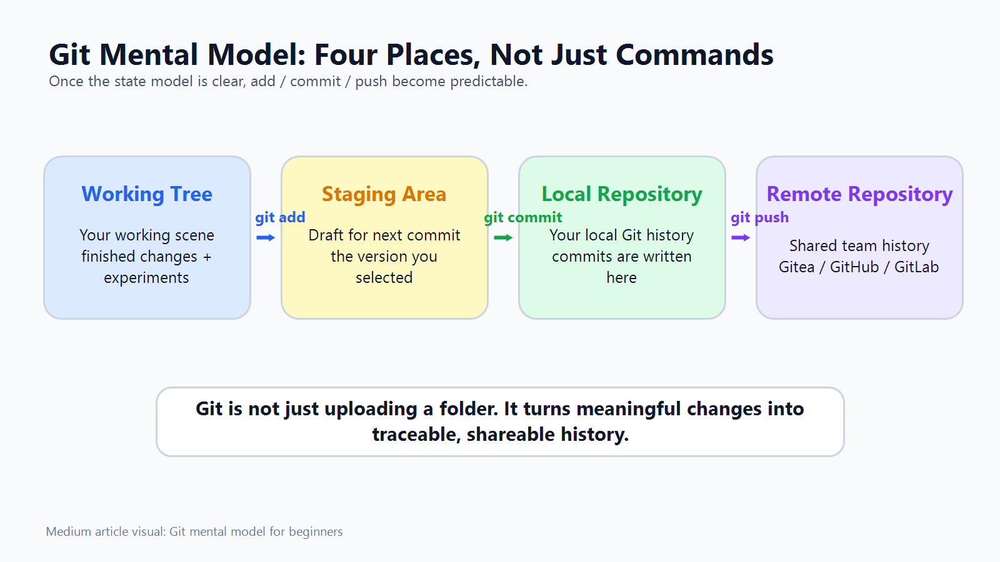
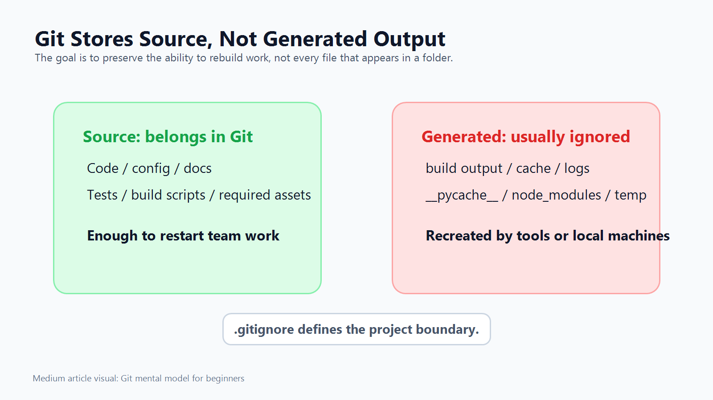
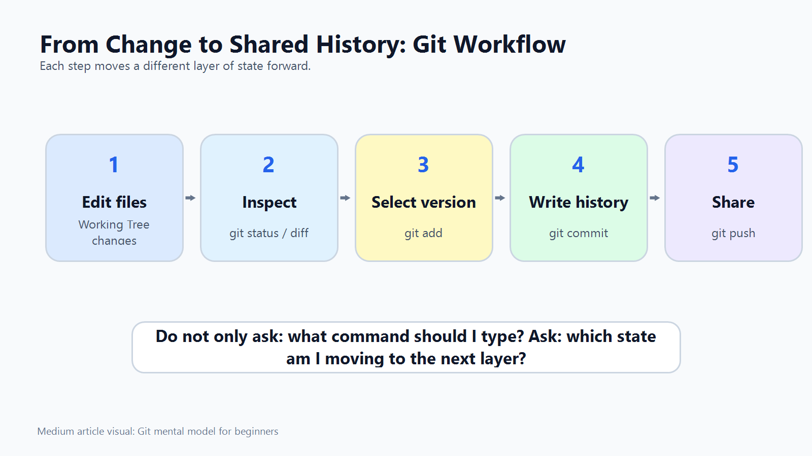

# From Optical Engineer to Software Engineer

This repository documents a real learning journey: the first time I truly understood Git through building and using a Gitea repository.

The article is not a Git command cheat sheet. It focuses on the shift from memorizing commands to understanding how Git organizes software work.



## Starting Point

My software engineering journey started after I had already worked in another engineering field. I learned Python on my own, then gradually moved into building tools, automation scripts, and real development workflows.

Git was one of the hardest parts.

I knew commands like:

```bash
git add
git commit
git push
git pull
```

But I did not understand what each command really changed. When something worked, I moved on. When something failed, especially around remote repositories or merge conflicts, Git felt like a fragile black box.

That changed during a real project where I created a Gitea repository and pushed code into it.

## The Core Misunderstanding

At first, I thought Git was mainly for saving code.

That is only part of the story. If the goal is only to save files, a zip file or cloud folder can do that. Git solves a deeper engineering problem:

- What changed?
- Why did it change?
- Which changes are ready to commit?
- Which changes are only experiments?
- Which change introduced a bug?
- Can the team restart work from a clean state?

The better way to understand Git is:

> Git preserves the team's ability to restart work.

## Git Stores Source, Not Generated Output



One important lesson was that Git should preserve Source, not generated output.

Source includes:

- source code
- configuration files
- documentation
- tests
- build scripts
- required assets

Generated output usually includes:

- compiled binaries
- cache files
- logs
- temporary files
- build output
- Python `__pycache__`
- Node.js `node_modules`

This changed the question from "Should I upload this file?" to:

> If another engineer clones this repository, will they have enough Source to recreate the same working capability?

That is also how `.gitignore` started to make sense. It defines the boundary between project Source and local machine output.

## The Four Places In Git

The model that finally made Git understandable was separating it into four places:

- Working Tree: the current working scene, including edits, experiments, and unfinished changes
- Staging Area: the draft of the next commit
- Local Repository: the Git history saved on my machine
- Remote Repository: the shared history on Gitea, GitHub, or GitLab

Once these places were clear, the commands became much less mysterious:

```text
git add    -> select the version for the next commit
git commit -> write that selected version into local history
git push   -> share local history with the remote repository
```

## What The Commands Really Mean

`git add` does not simply mean "add to Git."

It means:

> Take the version I choose from the Working Tree and place it into the Staging Area.

`git commit` does not upload anything.

It means:

> Write the staged version into my local Git history.

`git push` is the step that shares history.

It means:

> Send my local Git history to the Remote Repository.

This distinction helped me understand why Git has separate steps instead of one giant "save and upload" button.

## Merge Conflict

A merge conflict used to feel like I had broken Git.

Now I understand it differently:

> A merge conflict is Git stopping because two histories changed the same place, and Git cannot safely decide the correct meaning for me.

That is not failure. It is Git asking a human to make the engineering decision.

Resolving a conflict is not just deleting conflict markers. The real work is understanding both sides, deciding the correct final result, and committing that decision back into history.

## Workflow



The workflow I finally understood is:

```bash
# 1. Check the current working state
git status

# 2. Inspect what actually changed
git diff

# 3. Select the version I want in the next commit
git add <file>

# 4. Confirm what the next commit will contain
git diff --staged

# 5. Write the staged version into local history
git commit -m "Describe the change"

# 6. Share the local history with the remote repository
git push
```

The value is not only knowing the command sequence. The value is knowing which part of the Git system each command changes.

## Medium Article

The article version is kept in:

- [medium-git-mental-model-article.md](medium-git-mental-model-article.md)

Published Medium article:

- [From Optical Engineer to Software Engineer: The First Time I Understood Git Through Gitea](https://medium.com/p/d80175b1b839)

## Project Isolation

This repository belongs only to the `260703_GitTea` project.

It should not contain files, notes, images, scripts, TODOs, or Git history from other projects.
